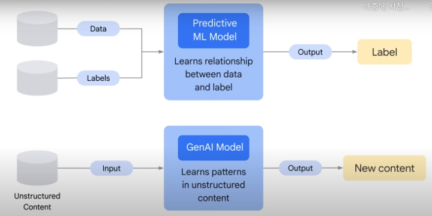

# 01. Introduction to Generative AI

## Define Generative AI

### AI(Artificial Intelligence)

> AI is the theory and development of computer systems able to **perform tasks normally requiring human intelligence**.

- CS의 한 줄기
- 과학 중 물리학 등 느낌
- 자동으로 배우고 행동한다.

### Machine Learning

> ML gives computers the ability to **learn without explicit programming**.

- AI 중 하나의 분야
- 물리학 중 천문학 느낌
- 입력 데이터로 모델을 학습하는 프로그램이나 시스템
- 학습된 모델은 다른 데이터나 본 적없는 데이터로 결과를 예측
- Supervised learning, Unsupervised learning, Reinforcement learning, Deep learning 등이 있다.

#### 1. Unsupervised ML models

> Unsupervised learning implies the data is **not labeled**.

- raw data를 통해서 연관성이 있는 데이터끼리 그룹화 시키는 것

#### 2. Supervised ML models

> Supervised learning implies the data is **already labeled**.

- 과거의 예시를 통해 미래의 값을 추측할 수 있도록 학습
- 예를 들어 한 식당에서 과거의 주문과 팁 관계를 통해 추후 들어올 팁을 예측하는 것
- training dataset을 통해 모델을 학습시키고 test를 통해 결과의 차이를 줄여가는 것

### Deep Learning

> Deep learning uses Artificial Neural Networks - allowing them to **process more complex patterns** than traditional
> machine learning.

- ML 중 하나의 분야
- 천문학 중 우주론 느낌
- 인공 신경망을 통해 전통적인 ML보다 복잡한 패턴으로 학습한다.
- 인공 신경망은 labeled data와 unlabeled data 모두 사용할 수 있다.
- 인공 신경망을 이용한 **Semi-supervised learning** 기법도 있다.
  - 이는 작은 양의 labeled data와 많은 양의 unlabeled data를 이용해 학습하는 것이다.
  - labeled data는 현재 과제의 컨셉에 대해 학습한다.
  - unlabeled data는 인공 신경망이 새로운 예시들을 일반화할 수 있도록 도와준다.
- 그리고 Deep Learning 안에 **Generative AI(Gen AI)**와 **Large Language Models(LLMs)** 등이 있다.

### Model Types

#### Discriminative model

- 분류하거나 예측하는데 사용
- 보통 labeled dataset을 사용하여 학습
- label과 특성 사이에 관계에 대해 학습

#### Generative model

- 학습된 데이터와 유사한 새로운 데이터를 생성한다.
- 데이터의 분포와 주어진 예제들을 이해한다.
- 문장의 다음 단어를 예측한다.

### Traditional ML vs Gen AI

- Output
  - Not Gen AI: Number, Discrete, Class, Probability
  - Gen AI: Natural language, Image, Audio

## Explain how Generative AI Works

### Hallucinations

> In transformers, hallucinations are words or phrase that are generated by the model that **are often nonsensical or
grammatically incorrect**.

- 모델에 의해서 생성되는 단어나 구문이 무의미하거나 문법적으로 올바르지 않은 경우
- 원인
  - 충분한 데이터로 학습되지 않음
  - 정제되지 않고 오류가 있는 데이터로 학습됨
  - 충분한 문장을 주지 않음
  - 충분한 제약 조건을 주지 않음

## Describe Generative AI Model Types

### text-to-text

- 입력 받은 자연어로 text를 생성하는 모델이다.
- 이 모델은 mapping된 한 쌍의 text들로 학습된다.
- 예를 들어 한국어와 동일한 의미의 영단어를 한 쌍으로 묶는다.

### text-to-image

- 입력 받은 자연어로 이미지를 생성하거나 수정하는 모델이다.
- 이 모델은 수많은 이미지 데이터들로 학습된다.

### text-to-video, text-to-3D

- 입력 받은 자연어로 비디오나 3d 이미지를 생성하는 모델이다.
- 한 문장이나 전체 스크립트를 입력 받으면 그에 맞는 비디오를 생성하거나 수정한다.
- 3D 모델 역시 주어진 입력으로 3D 이미지를 만들거나 수정한다.

### text-to-task

- 입력 받은 자연어로 과제를 수행하는 모델이다.
- 업무는 질문에 답하기, 검색, 예측하기 등 광범위하다.
- 학습된 모델로 web UI를 탐색하거나 GUI를 통해 문서를 변경할 수 있다.

### Foundation Model

- text, image, speach 등 광범위한 데이터들로 사전학습된 모델이다.
- 그렇기에 그에 따라 질문에 답하기, 분석, 이미지 캡쳐 등 다양한 과제들도 수행할 수 있다.
- 건강 관리, 고객 서비스 등에서 사용될 가능성이 있다.

## Describe Generative Applications

