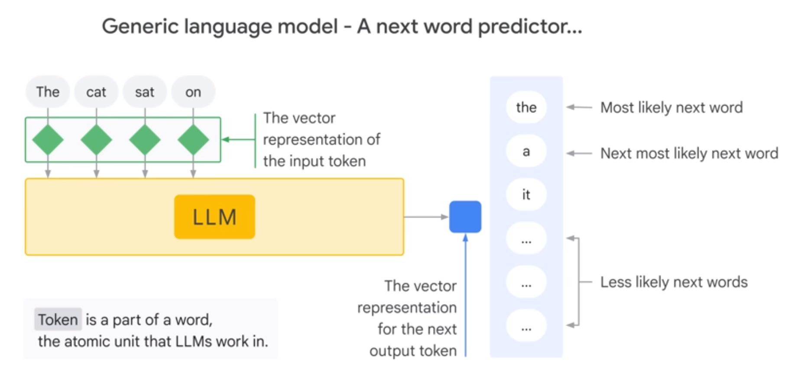
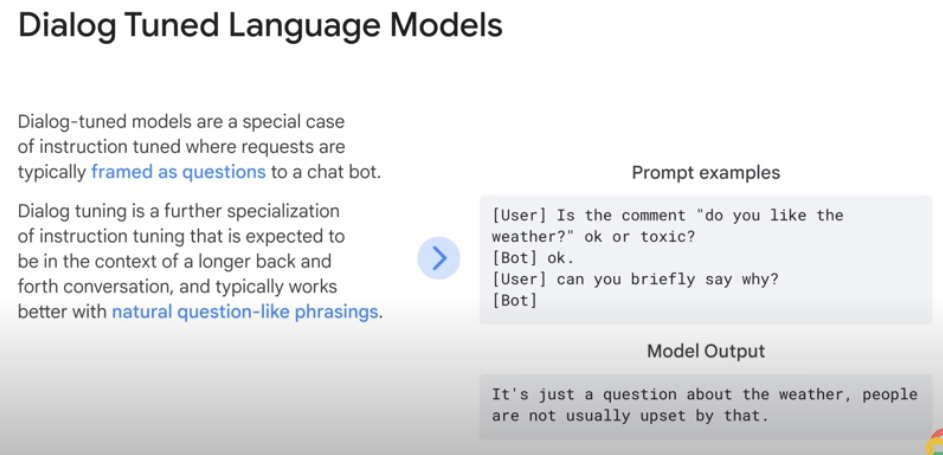

# 02. Introduction to Large Language Models

## Define Large Language Models
### LLM
> Large Language Models (LLMs) are a **subset of Deep Learning**

> **Large, general-purpose** language models can be **pre-trained** and then **fine-tuned** for specific purposes

- LLM은 공통적인 언어 문제들을 해결하기 위해 학습된 모델이다.
  - Text classification, Question answering, Summarization, Translation, Text generation 등

- Large
  - 많은 양의 데이터셋
  - 많은 양의 파라미터
- General purpose
  - 일반적인 자연어
  - 리소스 제한
- Pre-trained and fine-tuned
  - Pre-trained: 일반적인 자연어를 큰 데이터 셋으로 미리 학습
  - Fine-tuned: 특정한 문제를 해결하기 위해 작은 데이터 셋으로 학습

- LLM의 장점
  - 하나의 모델로 다양한 업무들에 사용 가능
  - 작은 데이터 셋으로 특정 분야의 학습이 가능
    - few-shot learning: 아주 작은 데이터만 가지고 fine-tuning
    - zero-shot learning: 데이터 없이 fine-tuning
  - 데이터와 파라미터가 많을수록 성능이 좋아짐

### Transformer model
- Input 데이터를 encoder에 넣어서 hidden state를 만들고, decoder에 넣어서 output 데이터를 만든다.

## Describe LLM Use Cases

## Explain Prompt Tuning
3가지 종류의 LLM이 있고 각각 다른 방법의 prompting이 필요하다.

### 1. Generic (or Raw) Language Models
> These predict the next word (technically token) based on the language int the training data.

- 학습 데이터를 토대로 다음 토큰에 뭐가 올지 예측한다.

### 2. Instruction Tuned
> Trained to predict a response to the instructions given in the input.

- 입력된 문장에 대한 요약, 일반적 형식, 키워드 등이 입력으로 주어지면 요약, 글쓰기 등이 출력
- 예를 들어 입력된 문장이 긍정적인지, 부정적인지 판별할 수 있다.

### 3. Dialog Tuned

> Trained to have a dialog by predicting the next response.

- 일반적으로 채팅 봇에 대한 질문에 대한 답변을 학습한다.

## Chain of Thought Reasoning

- 모델들은 일반적으로 정답의 이유를 설명하는 텍스트를 출력할 때 정답을 더 잘 맞춘다.
- 그러나 모델이 직접 정답을 맞출 가능성이 적기에 질문을 적절히 하며 연쇄적인 생각을 하도록 유도하는 것이 중요하다.

> 모든 것을 할 수 있는 모델에는 명확한 한계가 있다. 그렇기에 작업별 조정을 통해 LLM의 신뢰를 높여야 한다.
