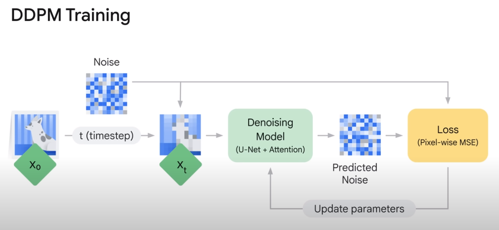

# 5. Introduction to Image Generation

## Image Generation Models

### VAEs(Variable Autoencoders)

- 이미지를 압축된 크기로 인코딩하고 데이터 분포를 학습하면서 원래 크기로 디코딩한다.

### GANs(Generative Adversarial Models)

- 두 개의 신경망을 대립시킨다.
- 하나는 생성자로 이미지를 생성하고 다른 하나는 판별자로 이미지의 진위 여부를 판별한다.
- 생성자는 판별자를 속이기 위해 진짜 같은 이미지를 생성하고 판별자는 생성자를 속이지 않기 위해 진짜와 가짜를 구분한다.

### Autoregressive Models

- 이미지를 픽셀 단위로 처리하여 이미지를 생성한다.
- LLM이 텍스트 처리하는 방식에서 영감을 받아 개발된 것

## Diffusion Model

- 이미지를 생성하는 방법 중 하나
- 열역학을 비롯한 물리학에서 영감을 받았다.
- 2015년에 처음 개념이 나온 뒤, 2020년부턴 연구, 산업 영역에서 많이 사용되고 있다.

- 조건 없는 확산 모델
    - 얼굴 등 구체적인 대상의 이미지를 학습하고 이 대상의 새로운 이미지를 생성
    - 저화질 이미지를 고화질 이미지로 변환(Super-Resolution)
- 조건 있는 확산 모델
    - text-to-image: 텍스트로 이미지 만들기
    - image-inpainting: 이미지 특정 부분을 제거하거나 추가하는 등 이미지 자체 편집
    - text-guided image-to-image: 텍스트를 기반으로 이미지 편집

## Diffusion Model 작동 원리

- 핵심 개념은 데이터 분포 구조를 반복적인 정방향 확산 프로세스를 통해 체계적으로 서서히 해체하는 것이다.
- 정확히는 1) 이미지에 반복적으로 노이즈를 더하고 2) 이미지를 복원하는 역확산 프로세스를 학습하여 유연성이 높고 다루기 쉬운 데이터 생성 모델을 얻는다.
- 이미지에 노이즈를 늘리고 다시 노이즈를 줄이며 이미지를 복원하는 과정을 반복하면서 학습하는 것이다.

## Denoising Diffusion Probabilistic Models(DDPM)

- 이 모델의 목적은 노이지를 제거하는 방법을 학습하도록 만드는 것이다.
- 순수한 노이즈에서부터 합성할 수 있는 모델을 얻을 수 있다.

### Diffusion Process adds noise to images

- 원본 이미지인 $X_0$ 에서부터 시작하여 노이즈를 반복해서 추가한다.
- 이 분포를 $q(X_t|X_{t-1})$ 라고 부르며 이전 단계에 전적으로 의존한다.
- 그렇기에 이 작업에 빈도 역시 고려해봐야 한다.
- 초기 논문은 1000번을 반복했으며 이미지는 일반적으로 순수한 노이즈가 된다.

### Reversed Diffusion Process removes noise

- 노이즈를 제거하는 역확산 과정을 학습한다.
- 이 과정은 $p_{theta}(X_{t-1}|X_{t})$ 로 표현한다.
- 학습 과정에서 모델은 이 이미지에 더해진 노이즈를 계산한다.

### DDPM Training

- 원본 이미지에 임의로 노이즈를 더해준 이미지로 Denoising Model에 입력한다.
- 그리고 모델이 예측한 노이즈와 실제 노이즈 차이를 최소화하는 방향으로 학습한다.

### DDPM Generation

- 모델로 예측한 노이즈를 제거하고 그 이미지에서 다시 노이즈를 예측해 제거하는 과정을 반복하면 이미지가 복원된다.
- 이 과정은 실제 데이터 분포에서 학습된 동작을 적용하여 새롭고 독창적인 이미지를 만들 수 있다.
