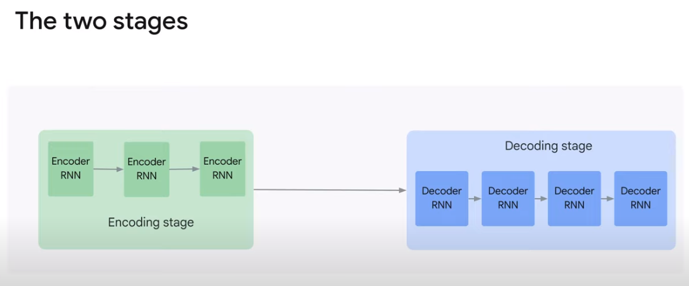

# 6. Encoder-Decoder Architecture

## Overview

- Encoder-Decoder 구조는 Sequence-to-Sequence 구조이기도 하다.
- 즉, 문장을 입력으로 받아서 문장을 출력으로 내보낸다는 의미다.

### Encoder-Decoder stages

- Encoder는 입력 문장의 벡터 표현을 생성한다.
- Decoder는 Encoder의 벡터 표현을 입력으로 받아서 출력 문장을 생성한다.
- Encoder와 Decoder는 내부는 위 사진처럼 순환 신경망일 수도 있고, 더 복잡한 transformer block일 수도 있다.

#### Encoder

- 각 토큰을 한 번에 하나씩 가져와 이 토큰과 이전에 수집된 모든 토큰을 나타내는 상태를 생성한다.
- 그리고 이 상태를 다음 상태를 생성하기 위해 다음 토큰과 함께 인코딩 단계에서 입력으로 사용된다.

- 모든 입력 토큰을 수집한 후에는 전체 입력 문장을 나타내는 벡터를 출력한다.

#### Decoder

- decoder는 입력 문장의 벡터 표현을 받아서 해당 표현으로부터 출력 문장을 생성한다.
- RNN 디코더의 경우, 단계적으로 수행하여 현재 상태와 지금까지 디코딩된 내용을 사용하여 한 번에 하나의 토큰 출력을 디코딩한다.

### Train

- 학습을 위해선 비교할 입출력 쌍의 데이터셋이 필요하다.
- 해당 데이터셋을 모델에 공급하며, 모델은 데이터셋의 특정 입력에서 생성되는 오류를 기반으로 훈련 중에 자체 가중치를 수정한다.
- 이 오류는 본질적으로 입력 시퀀스가 주어지면 신경망이 생성하는 것과 데이터셋 안에 있는 실제 출력 간의 차이다.

- Encoder-Decoder 학습 데이터 생성은 일반적인 예측 모델보다 복잡하다.
- 번역 데이터셋을 예로 들면

1. 입력 문장과 그것이 번역된 출력 문장 쌍이 있어야 한다.
2. 그 후, 인코더에 입력 문장을 넣고 디코더로 출력된 문장을 출력 문장과 비교하여 오류를 측정한다.

- 하지만 디코더에는 훈련 시, 자체 입력도 필요하다.
- 디코더가 지금까지 생성한 토큰이 아닌 다음 토큰을 생성하려면 이전에 올바르게 변환된 토큰을 입력으로 디코더에 제공해야 한다.
- 이 방식을 **Teacher Forcing**이라고 한다.
    - 왜냐하면 올바른 이전 토큰에서 다음 토큰을 생성하도록 강제하기 때문이다.
    - 이 의미는 코드에서 원래 인코더에 입력된 문장과 왼쪽으로 이동된 원래 문장을 준비하여 디코더에 입력해야 함을 의미한다.
- 또 미묘한 점은 디코더가 각 단계에서 어휘의 각 토큰이 다음 토큰일 확률만 생성한다는 것이다.
- 이러한 확률을 가지고 단어를 선택해야 하며 이에 대한 몇가지 방법이 있다.
    - 그리드 검색
        - 가장 높은 확률을 가진 토큰을 생성하는 것
    - 빔 검색
        - 더 나은 결과를 생성하는 더 나은 접근 방식
        - 디코더에서 생성된 확률을 사용하여 개별 단어가 아닌 문장 덩어리의 확률을 평가
        - 각 단계에서 생성될 가능성이 가장 높은 청크를 유지

### word generation

새번역이나 응답을 생성하는 경우

1. go와 같은 특수 토큰과 함께 프롬프트의 인코더 표현을 디코더에 공급하는 것으로 시작한다.
2. 임베딩 레이어를 사용하여 벡터로 표현된다.
3. 인코더에서 생성된 이전 상태를 새 상태로 업데이트한다.
4. 새 상태는 단어 확률을 생성하기 위해 소프트맥스 레이어로 전달된다.
5. 그리드 서치나 빔 서치로 단어를 선택한다.
6. 문장이 끝날 때까지 반복한다.

## Lab Walkthrough
