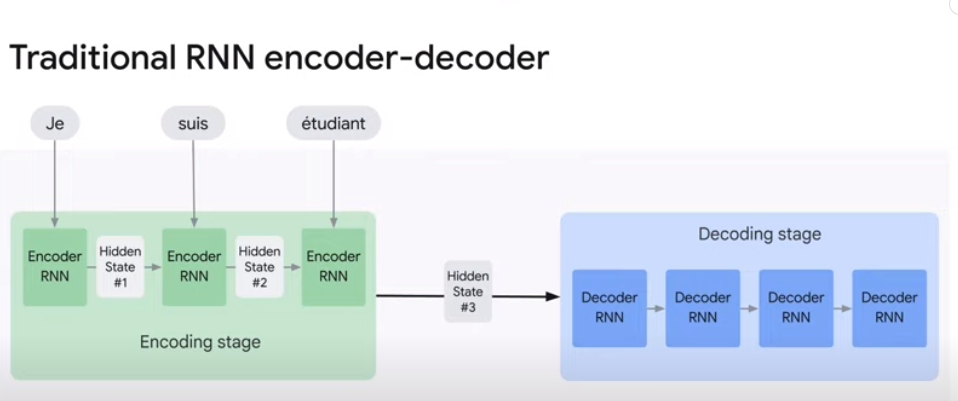
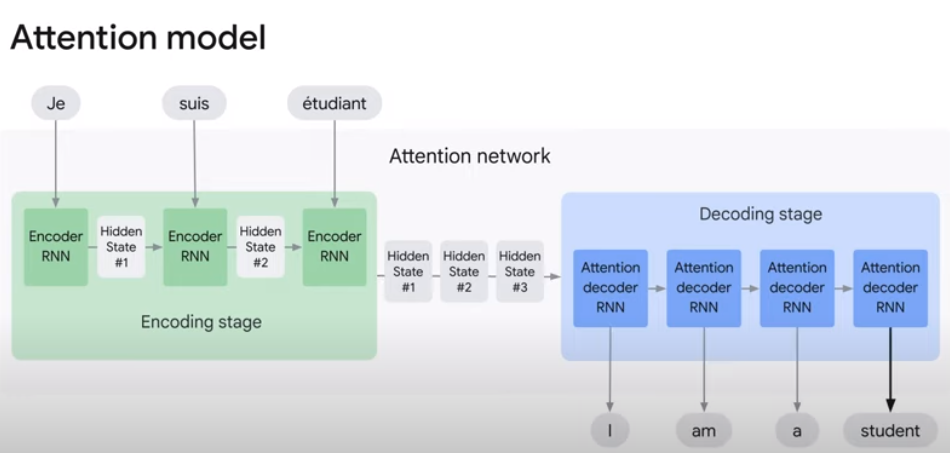
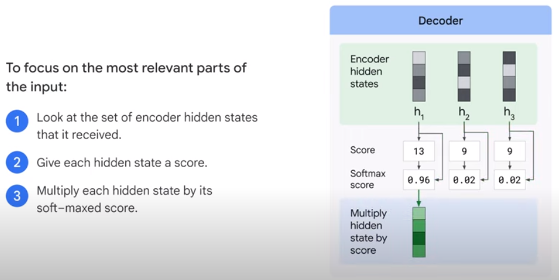
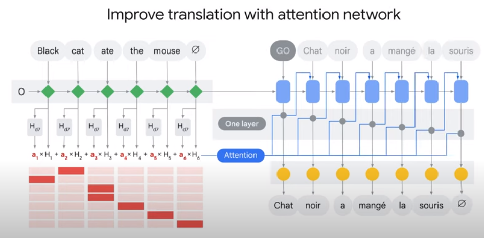

# 7. Attention Mechanism

## Transformer의 특징 및 한계

- 만약 영어를 프랑스어로 번역하고 싶다면 transformer 모델은 많이 사용되는 모델이다.
- 인코더, 디코더는 한 번에 한 단어를 가져와 각 시간 단계에서 번역한다.

- 그러나 때로는 원어의 단어가 대상 언어의 단어와 일치하지 않는 경우도 있다.
- 예를 들어 "Black cat ate the mouse."를 번역할 때, 영어는 첫 단어가 "Black"이지만 프랑스어는 "Chat"이고 이는 고양이를 의미한다.
- 그래서 "black" 대신 "cat"에 더 집중할 수 있는 방법을 찾게 된다.

## Attention Mechanism

- 위 같은 문제를 해결하기 위해 attention mechanism을 추가할 수 있다.
- 어텐션 메커니즘은 신경망이 입력 시퀀스의 특정 부분에 집중할 수 있도록 만드는 기술이다.
- 이는 가장 중요한 부분이 가장 높은 가중치를 받도록 입력 시퀀스의 여러 부분에 가중치를 할당하는 방법으로 수행된다.

### Traditional RNN encoder-decoder

- 위는 전통적인 RNN 인코더-디코더 모델이다.
- 입력이 숨겨진 상태를 최신화하고 이를 다음 시간 단계로 전달할 때 모델은 한 번에 한 단어씩 사용 한다.
- 결국 최종 숨겨진 상태만 디코더에 전달된다.
- 디코더는 처리를 위해 최종 숨겨진 상태와 함께 작동하고 이를 대상 언어로 번역한다.

### Attention model differs from traditional model

- 어텐션 모델은 전통적인 시퀀스 투 시퀀스 모델과 두 가지 면에서 다르다.

1. 인코더는 훨씬 더 많은 정보를 디코더에 전달한다.
    - 인코더는 각 시간 단계의 모든 숨겨진 상태를 전달한다.
    - 이는 최종 숨겨진 상태보다 더 많은 정보를 전달한다.
    - 그리고 디코더는 모든 숨겨진 상태 정보를 사용하여 문장을 번역한다.

2. 출력을 생성하기 전에 어텐션 디코더에 추가하는 단계를 추가하는 것이다.
    - 입력 중 가장 관련성이 높은 부분에만 집중하는 방법
        1) 수신한 인코더 상태들의 셋을 살펴본다. 각 인코더의 숨겨진 상태는 입력 문장의 특정 단어와 연결된다.
        2) 각 숨겨진 상태에 점수를 부여한다.
        3) 숨겨진 상태에 소프트-맥스 점수를 곱한다.
        4) 점수가 높은 것을 증폭시키고 낮은 것을 감소시킨다.

## Improve translation with attention network

- 위 그림은 어텐션 메커니즘을 사용하여 번역을 개선하는 방법을 보여준다.
- "Black cat"에서 "cat"의 가중치가 더 높은 것을 볼 수 있다.
- 또한 "ate"의 경우 "a mange"로 두 단어를 주목하는 동안 "ate"에만 집중하는 것을 볼 수 있다.

- 이 프로세스는 디코더에 의해 문장 토큰이 생성될 때까지 계속된다.
- 
