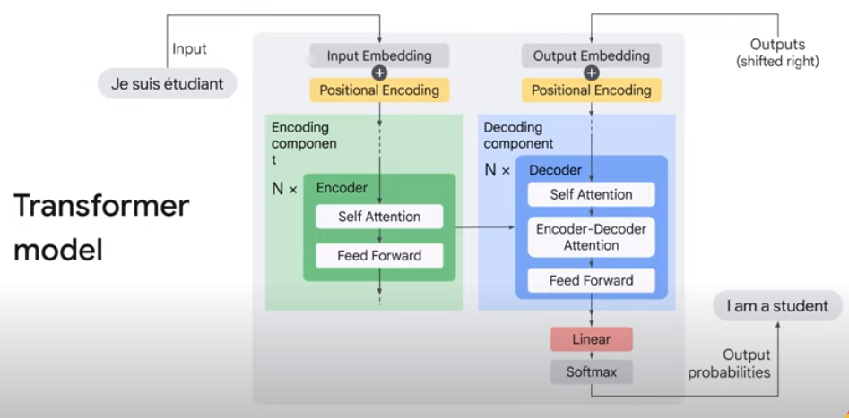
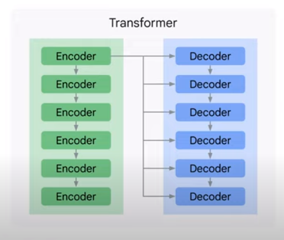
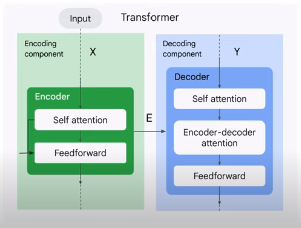
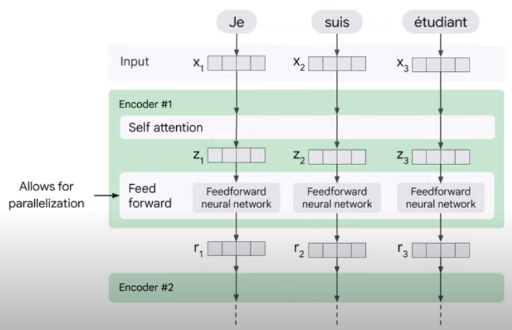
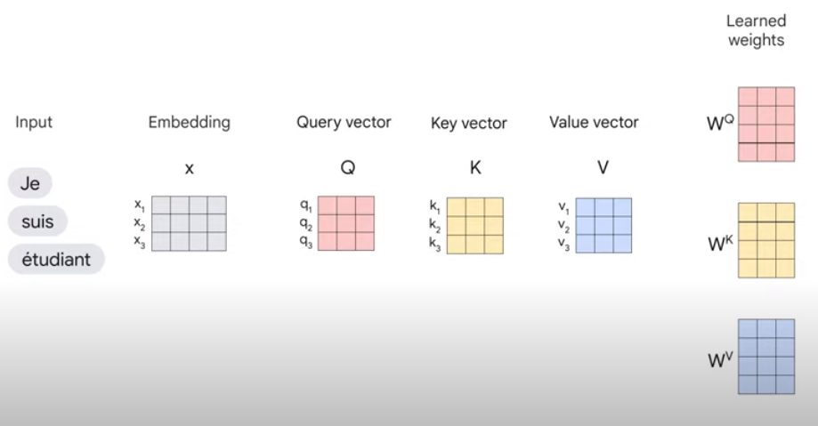

# 8. Transformer Models and BERT Model

## Transformer

- Transformer는 Attention As All You Need라는 2017년 논문을 기반으로 한다.
- 이전의 모든 모델들은 단어를 벡터로 표현할 수 있었지만 이러한 벡터들은 문맥이 포함되어 있지 않으며 문맥에 따라 단어의 사용법도 달랐다.

- Transformer는 Attention 메커니즘을 사용한 encoder-decoder 모델이다.
- 모델 구조 덕분에 복수화의 장점을 활용하고 동시에 많은 양의 데이터를 처리할 수도 있다.
- 또한 코어에는 Attention 메커니즘을 사용하여 구축되어 있다.

### Encoder and Decoder

- 논문에는 동일한 Encoder와 Decoder를 6개씩 스택으로 쌓았다.

#### Encoder

- 인코더는 구조가 모두 동일하지만 가중치가 다르다.
- 그리고 각 인코더는 두 개의 하위 계층으로 나눈다.
- 첫 번째 레이어는 Self attention이다.
    - 인코딩의 입력은 먼저 self attention 레이어를 통과하는 흐름
    - 입력 문장의 중심 단어를 인코딩할 때 단어의 관련 부분을 인코딩하거나 보는 데 도움이 된다.
- 두 번째 레이어는 Feedforward이다.
    - feedforward 레이어의 입력으로 self attention 레이어의 출력이다.
    - 정확히 동일한 feedforward 레이어가 각 위치에서 독립적으로 적용된다.

#### Decoder

- 디코더는 인코더처럼 self attention과 feedforward 레이어를 가지고 있지만, 사이에 입력 문장의 관련 부분에 집중하는 데 도움이 되는 attention 레이어인 encoder-decoder
  attention 레이어가 있다.

#### 흐름

1. 입력 시퀀스에 단어를 삽입한 후 각 삽입 벡터는 인코더의 두 레이어를 통해 흐른다.
2. 각 위치의 단어는 self attention 과정을 거친다.
    - 이 과정에선 경로 사이에 종속성이 존재한다.
3. 그 후, 각 벡터가 별도로 흐르는 완전히 동일한 네트워크인 feedforward 신경망을 통과한다.
    - 하지만 이 과정에선 종속성이 존재하지 않아 병렬로 처리가 가능하다.

### Self attention

- 이 레이어에선 입력 임베딩은 쿼리, 키, 값 벡터로 나뉜다.
- 그리고 이러한 벡터는 학습 과정에서 변환기가 학습한 가중치를 사용하게 된다.
- 이러한 계산들은 모델에서 행렬 계산의 형태로, 병렬로 발생한다.

- 쿼리, 키, 값 벡터를 구했으면 다음은 합산을 준비하기 위해 각 값 벡터에 소프트 맥스 점수를 곱한다.
- 여기서 의도는 집중하려는 단어의 값을 그대로 유지하고 0.001과 같은 작은 숫자를 곱하여 관련 없는 단어를 제외하는 것이다.

### [Lab Walkthrough](https://www.youtube.com/watch?v=6hhvQb8tSPs)