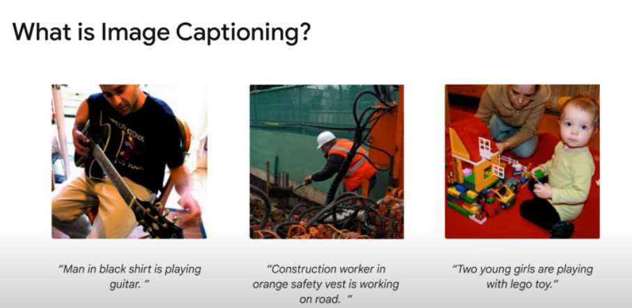
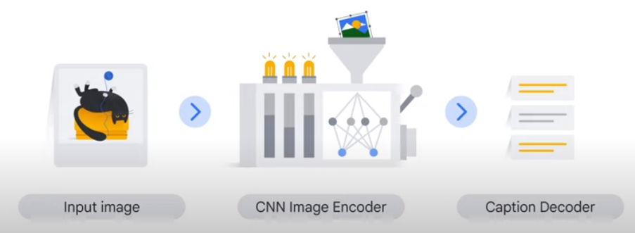
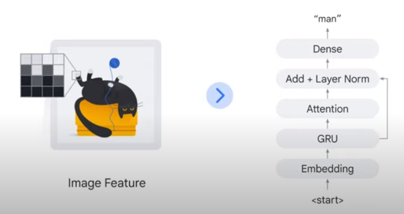
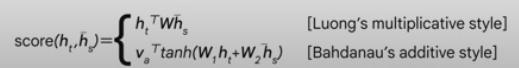
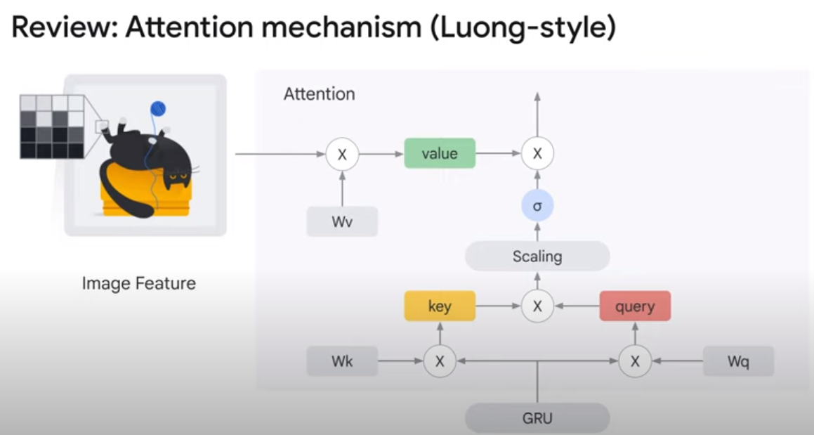
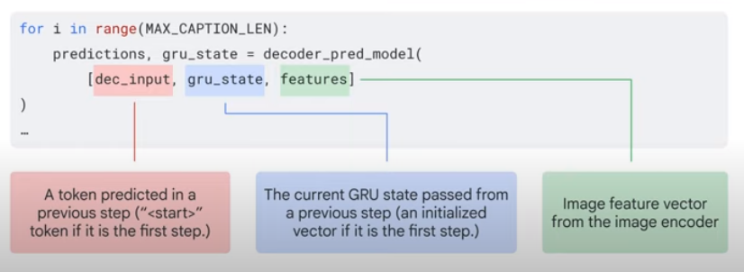

# 9. Create Image captioning models

## Overview



- 이번 강의의 목표는 이미지 기반으로 위와 같은 텍스트 캡션을 생성할 수 있는 모델을 구축하고 훈련하는 것



- 이를 구현하기 위해 일종의 인코더-디코더 모델을 사용할 것이다.
- 하지만 이 경우엔 인코더와 디코더가 이미지와 텍스트라는 서로 다른 데이터 형식을 처리한다.
- 이미지를 인코더에 전달하고 디코더가 텍스트를 내보내는 형태이다.

### Encoder

- `ResNet`, `EfficientNet`, `Vision Transformer`와 같은 종류의 이미지 backbone을 사용한다.
- 여기선 이미지 backbone을 사용하여 특징을 추출할 것이다.

```python
image_input = Input(shape=(IMG_HEIGHT, IMG_WIDTH, IMG_CHANNELS))

feature_extractor = InceptionResNetV2(include_top=False)
image_features = feature_extractor(image_input)

x = Reshape((FEATURES_SHAPE[0] * FEATURES_SHAPE[1], FEATURES_SHAPE[2]))(image_features)

encoder_output = Dense(ATTENTION_DIM, activation='relu')(x)
```

- 여기선 Keras의 `InceptionResNetV2`를 사용하여 이미지 backbone을 구축한다.

### Decoder



- 단어를 하나씩 가져와 인코더 출력에서 나오는 단어와 이미지의 정보를 토대로 다음 단어를 예측한다.
- 따라서 디코더 자체는 반복 작업을 한다. 그리고 이를 자동회귀적(autoregressively)으로 계속 호출하면 텍스트 캡션을 생성할 수 있다.
- 이를 구현하기 위해 다양한 디코더 형식이 있지만 여기서는 RNN이나 GRU를 사용하여 구축한다.

#### GRU

- 단어 임베딩 생성

```python
word_input = Input(shape=(MAX_CAPTION_LEN))
embed_x = Embedding(VOCAB_SIZE, ATTENTION_DIM)(word_input)

decoder_gru = GRU(
    ATTENTION_DIM, # Number of units
    return_sequences=True, # Pass the full sequence
    return_state=True, # Return the last state
)

gru_output, gru_state = decoder_gru(embed_x)
```

#### Attention

- 텍스트와 이미지 정보를 혼합

```python
# Luong-style attention
tf.keras.layers.Attention

# Bahdanau-style attention
tk.keras.layers.AdditiveAttention
```



```python
decoder_attention = Attention()
context_vector = decoder_attention([gru_output, encoder_output])
```



- attention mechanism 기존의 것과 거의 동일하다.
- 하지만 텍스트 데이터의 이미지 특징에 주목한다는 특징이 있다.
- 이를 통해 두 정보를 혼합하여 attention score를 계산할 수 있다.

- 내부적으로는 `gru_output`이 attention 쿼리와 키로, `encoder_output`이 attention 값으로 사용된다.

#### Add + Layer Norm, Dense

- 추가 레이어와 레이어를 정규화하는 레이어
- 레이어를 추가하면 동일한 모양이 벡터 두 개만 추가된다.

```python
addition = Add()([gru_output, context_vector])

layer_norm = LayerNormalization()(axis=-1)
layer_norm_out = layer_norm(addition)

decoder_output_dense = Dense(VOCAB_SIZE)
decoder_output = decoder_output_dense(layer_norm_out)
```

- `gru_output`은 attention 레이어로 전달되면서 추가 레이어에도 직접 전달된다.
- 그리고 이러한 흐름은 추가 레이어에서 병합된다.

- 이러한 종류의 구조를 `Skip Connection`이라고 하며 `ResNet` 이후 매우 인기 있는 심층 신경망 설계패턴이다.
- 그래서 `Residual Connection(잔여 연결)`이라고도 한다.
- 이 구조는 아주 깊은 신경망을 설계할 때 매우 유용하다. 그리고 transformer도 사용하고 있다.

### Inference Loop

1. GRU 초기 상태를 생성하고 시작 토큰을 생성하는 것
    - 훈련 단계에서 TensorFlow Keras는 각 시퀀스에 대해 gru_state를 자동 으로 처리할 수 있다.
    - 하지만 여기선 자체 정의 함수를 설계했기에 이를 명시적으로 처리하는 로직을 작성해야 한다.
    - 따라서 각 캡션 시작 시, 특정 값으로 gru_state를 명시적으로 초기화한다.
    - 시작할 땐, 문장의 시작을 의미하는 특수 토큰인 시작 토큰을 전달한다.
    ```python
    # Create GRU initial state vector (e.g.[0, 0, 0, 0, ..., 0])
    gru_state = tf.zeros((1, ATTENTION_DIM))
    
    # Create start token
    dec_input = tf.expand_dims([tokenizer.word_index['<start>']], 1)
    ```
    - gru_state와 start token을 초기화한다.
    - 위 코드에선 gru_state는 0개의 벡터로 초기화된다.
    - 시작 토큰은 디코더의 첫 번째 토큰으로 설정한다.
2. 논의한 대로 입력 이미지를 인코더에 전달하고 특정 벡터를 추출한다.
    ```python
   # Read and prepocess and image
   img = tf.image.decode_jpeg(tf.io.read_file(filename), channels=3)
   img = tf.image.resize(img, (IMG_HEIGHT, IMG_WIDTH))
   img = img / 255
   
   # Extract a feature vector using the encoder
   features = encoder(tf.expand_dims(img, axis=0))
    ```
    - 입력 이미지를 약간 전처리하여 훈련하는 인코더에 전달한다.
    - 이미지 전처리 측면에서 첫 줄 코드를 읽는다.
    - 그리고 임의의 해상도에서 특정 해상도로 크기를 조절한다.
    - 스케일을 0~255에서 0~1로 변경한다.
3. 벡터를 디코더에 전달하고 종료 토큰이나 64와 같은 숫자를 지정하는 하이퍼 파라미터인 `MAX_CAPTION_LENGTH`에 도달할 때까지 for 루프에서 캡션 단어를 생성한다.
    - for 루프에서는 디코더를 자동 회귀적으로 호출하여 캡션 생성의 모든 절차를 정의한다.
    - 종료 토큰은 시퀀스의 끝을 의미하는 특수 토큰이다.
    - 따라서 디코더가 종료 토큰을 생성하거나 캡션 길이가 최댓값에 도달하면 for 루프는 끝나게 된다.

   
    - 복잡하지만 중요한 점은 세 가지를 전달하여 디코더를 호출하는 것이다.
    - `dec_input`은 이전 반복에서 예측된 단어 토큰이다. 만약 첫 문장이면 시작 토큰이 될 것이다.
    - `gru_state`는 현재 GRU 상태이다. 그리고 디코더는 항상 업데이트된 GRU 상태를 출력한다.
    - `features`는 인코더로 추출한 이미지 특징이다. 이를 전달함으로써 실제 다음 예측 단어를 얻을 수 있다.

## [Lab Walkthrough](https://www.youtube.com/watch?v=c8VO_Lf1cjA&t=1s)